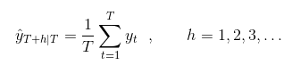
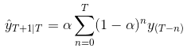
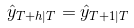
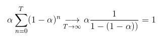
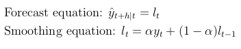
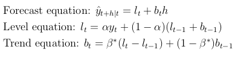
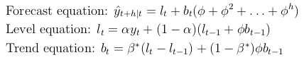
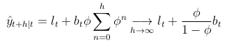

# Time series and Exponential smoothing

## Time series [Schumway]
A *stochastic process* is a set of random variables {yₜ, t ∈ I}. 

The result of an observation of these variables is a *realization* of the stochastic process, also called *time series*.
It is customary to also refer to the process giving rise to a time series as a time series.

If the indexing set I is countable (uncountable), then the time series is said to be *discrete* (*continuous*).

## Forecasting methods and models [Hyndman]
*Forecasting method*: algorithm that gives a prediction of the value of the series at a certain future time.

*Forecasting model*: stochastic data generating algorithm, producing a prediction of the probability distribution at a future time period.
A point forecast can be obtained by taking the mean of this probability distribution.

## Exponential smoothing forecasting methods [Hyndman, Athanasopoulos]

It is common to try to split a time series into three components: the *trend* (or level) (T), *seasonal* (S) and *error* (E) components. 
These components can be combined in different ways.
For example by simply adding them, so that y = T + S + E, or by assuming multiplicative seasonality but additive error, so that y = T x S + E.

The exponential smoothing methods ignore the error component, and have corresponding models (more specifically state space models). We will only discuss the methods, not the models.

Exponential smoothing was introduced in the late 1950's by Brown, Holt and Winters.
Roughly speaking, an exponential smoothing method forecasts using a weighted average whose weights decrease exponentially as the corresponding observation gets older.   
There are different exponential smoothing methods, which we will briefly discuss.

### Simple exponential smoothing 
**Use:** forecasting using data with no trend and no seasonality.

To understand simple exponential smoothing it helps to first describe the *average forecasting method*, which is one of the simplest forecasting methods.
In this case, the forecast is simply the average of the observations: 

  

where |T in the subscript means we are using the T first datapoints for the forecast.
This is clearly too simple for most cases. 

*Simple exponential smoothing (SES)* is similar to the average method, but the average is weighted, with the weights decreasing exponentially "with age".
More precisely:

To fit the time series + forecast the next point:

  

where 0 < α < 1 is the so-called *smoothing parameter*.  
To forecast further in the future one just uses the last predicted value:   

**Remarks:**
- Notice that the sum of all the weights is 

  

as it should be in a weighted average.  

- SES simply forecasts a horizontal straight line, thus not accounting for seasonality or trend.

- A good value for α is usually found using least squares (minimizing the sum of squared errors (SSE)).

- The way we defined SES is fairly natural.
It turns out that we can formulate SES in another form - called the *component form* - which will be useful for future generalization of this method.
It consists of two equations:

  

### Holt's linear trend method
**Use:** forecasting using data with an approximately constant trend but without seasonality.

*Holt's linear trend method* is an extension of SES which separates T in two components: the level l and the trend (slope) b; it modifies the forecast and smoothing equations and introduces a new equation for the new component b as follows:

  

where 0 < α < 1 is the smoothing parameter for the level and 0 < β\* < 1 is the smoothing parameter for the trend.  

**Remarks:**
- The level lₜ at time t is still (like in SES) a weighted average between yₜ and the estimate of yₜ (using the data points up to time t-1).  
- The trend bₜ at time t is a weighted average between the natural estimate lₜ - lₜ₋₁ of the slope/trend and the previous trend bₜ₋₁ .
- The forecast is no longer flat! Instead, it is a linear function of h.

### Holt's damped trend methods
**Use:** forecasting using data with a decreasing trend but without seasonality.

It is clear that the Holt's linear trend method tends to overshoot in many cases for long forecast horizons (h substancially greater than 1). One can try to solve this by introducing damping of the trend such that the level does not increase indefinitely.

*Holt's damped trend method* is similar to Holt's linear trend method, but includes a *damping parameter* 0 < ϕ < 1 as follows:

  

**Remarks:**
- It is easy to see how bₜ and lₜ are damped. To see that the forecasts of yₜ get flatened (capped slope) for high h, just notice that:

  

So *e.g.* for ϕ = 0.9 the forecast approaches the line lₜ + 9bₜ (its slope never surpasses 9bₜ).

### Holt-Winters' additive seasonal method
### Table with all Exponential Smoothing methods

## References:
- [Schumway]: 
- [Hyndman]: 
- [Athanasopoulos]:

