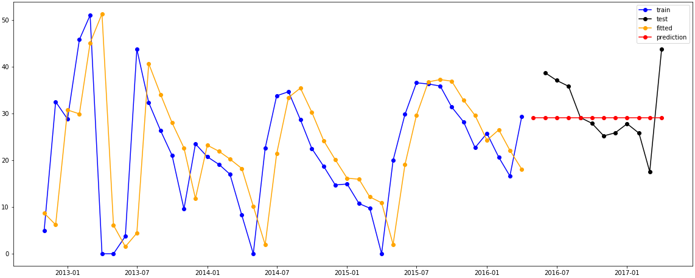
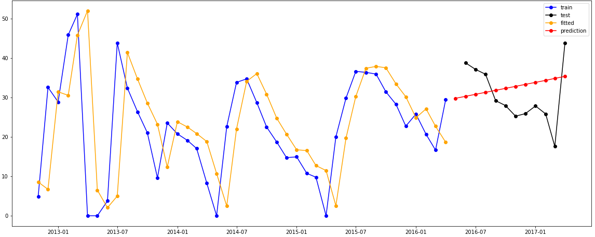
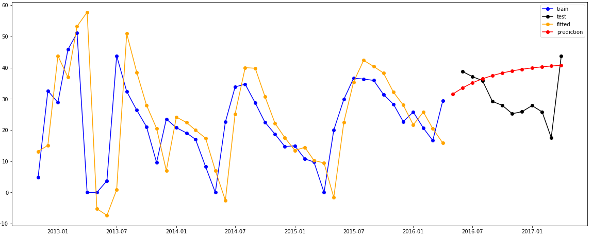
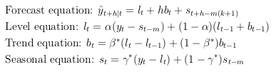
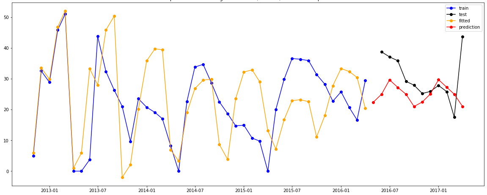

# Mosquito population forecast with Exponential smoothing

## Context
This is a summary of the exponential smoothing methods, as applied to the forecast of the mosquito population in the Philippines.
This is supposed to support the notebook in this repository, which was created during a Healthcare Hackaton on the February 15th and 16th 2020. My team tackled the problem of forecasting the mosquito population (to better prepare for Dengue) in the Philippines. This project was proposed by the Red Cross, and we ended up writing a Medium article about it.

More information about the problem and our approach can be found in said article. Here it suffices to say that a baseline exponential smoothing time series model was our starting point, and I was responsible for that. 

Let's review the exponential smoothing methods and see what we get when we apply them to the mosquito population.

## Time series [Schumway]
A *stochastic process* is a set of random variables {yₜ, t ∈ I}. 

The result of an observation of these variables is a *realization* of the stochastic process, also called *time series*.
It is customary to also refer to the process giving rise to a time series as a time series.

If the indexing set I is countable (uncountable), then the time series is said to be *discrete* (*continuous*).

## Forecasting methods and models [Hyndman]
*Forecasting method*: algorithm that gives a prediction of the value of the series at a certain future time.

*Forecasting model*: stochastic data generating algorithm, producing a prediction of the probability distribution at a future time period.
A point forecast can be obtained by taking the mean of this probability distribution.

## Exponential smoothing forecasting methods [Hyndman, Athanasopoulos]

It is common to try to split a time series into three components: the *trend* (or level) (T), *seasonal* (S) and *error* (E) components. 
These components can be combined in different ways.
For example by simply adding them, so that y = T + S + E, or by assuming multiplicative seasonality but additive error, so that y = T x S + E.

The exponential smoothing methods ignore the error component, and have corresponding models (more specifically state space models). We will only discuss the methods, not the models.

Exponential smoothing was introduced in the late 1950's by Brown, Holt and Winters.
Roughly speaking, an exponential smoothing method forecasts using a weighted average whose weights decrease exponentially as the corresponding observation gets older.   
There are different exponential smoothing methods, which we will briefly discuss.

### Simple exponential smoothing 
**Use:** forecasting using data with no trend and no seasonality.

To understand simple exponential smoothing it helps to first describe the *average forecasting method*, which is one of the simplest forecasting methods.
In this case, the forecast is simply the average of the observations: 

  

where |T in the subscript means we are using the T first datapoints for the forecast.
This is clearly too simple for most cases. 

*Simple exponential smoothing (SES)* is similar to the average method, but the average is weighted, with the weights decreasing exponentially "with age".
More precisely:

To fit the time series + forecast the next point:

  

where 0 < α < 1 is the so-called *smoothing parameter*.  
To forecast further in the future one just uses the last predicted value:   

  

**Remarks:**
- Notice that the sum of all the weights is 

  

as it should be in a weighted average.  

- SES simply forecasts a horizontal straight line, thus not accounting for seasonality or trend.

- A good value for α is usually found using least squares (minimizing the sum of squared errors (SSE)).

- The way we defined SES is fairly natural.
It turns out that we can formulate SES in another form - called the *component form* - which will be useful for future generalization of this method.
It consists of two equations:

  

### Holt's linear trend method
**Use:** forecasting using data with an approximately constant trend but without seasonality.

*Holt's linear trend method* is an extension of SES which separates T in two components: the level l and the trend (slope) b; it modifies the forecast and smoothing equations and introduces a new equation for the new component b as follows:

  

where 0 < α < 1 is the smoothing parameter for the level and 0 < β\* < 1 is the smoothing parameter for the trend.  

  

**Remarks:**
- The level lₜ at time t is still (like in SES) a weighted average between yₜ and the estimate of yₜ (using the data points up to time t-1).  
- The trend bₜ at time t is a weighted average between the natural estimate lₜ - lₜ₋₁ of the slope/trend and the previous trend bₜ₋₁ .
- The forecast is no longer flat! Instead, it is a linear function of h.

### Holt's damped trend methods
**Use:** forecasting using data with a decreasing trend but without seasonality.

It is clear that the Holt's linear trend method tends to overshoot in many cases for long forecast horizons (h substancially greater than 1). One can try to solve this by introducing damping of the trend such that the level does not increase indefinitely.

*Holt's damped trend method* is similar to Holt's linear trend method, but includes a *damping parameter* 0 < ϕ < 1 as follows:

  

  

**Remarks:**
- It is easy to see how bₜ and lₜ are damped. To see that the forecasts of yₜ get flatened (capped slope) for high h, just notice that:

  

So *e.g.* for ϕ = 0.9 the forecast approaches the line lₜ + 9bₜ (its slope never surpasses 9bₜ).

### Holt-Winters' additive seasonal method
**Use:** forecasting using data with an approximately constant trend and with seasonality, and the seasonal variations are approximately constant accross time.

*Note:* If the seasonal variations are approximately proportional to the level, then one uses the so called multiplicative seasonal method.

*Holt-Winters' additive seasonal method* is similar to Holt's linear trend method, but includes a ** 0 < ϕ < 1 as follows:
*Holt-Winters' additive seasonal method* is an extension of Holt's linear trend method which adds the seasonal component S introducing a new equation for the new component sₜ as follows:

  

where m is the *seasonality frequency* (number of data points per season) and k = floor((h-1)/m).

  

**Remarks:**
- The level equation simply subtracts the seasonal part from y to get the level estimate. The trend equation of course needs no correction.
- The seasonal equation is a weighted average of the seasonal component estimate (yₜ - lₜ) and the seasonal component sₜ₋ₘ from the last period.
- The forecast equation contains sₜ₊ₕ₋ₘ₍ₖ₊₁₎ so that it always used the last fitted seasonality (*i.e.* it does not use the forecasted seasonality for new forecasts!). *e.g.* if h = 3m + n where n is smaller than m, then k=3 and the seasonal component added to the forecast is sₜ₊ₕ₋₄ₘ = sₜ₋ₘ₊ₙ.

### Table with all Exponential Smoothing methods
We can introduce damping in seasonal methods and assume multiplicative seasonality instead of additive seasonality.
All these options together give us a list of all the exponential smoothing methods:

|           |                      |          |  Seasonality |                    |
|-----------|----------------------|:--------:|:------------:|:------------------:|
|           |                      | N (None) | A (Additive) | M (Multiplicative) |
|           | N (None)             |  (N, N)  |    (N, A)    |       (N, M)       |
|**Trend**  | A (Additive)         |  (A, N)  |    (A, A)    |       (A, M)       |
|           | Ad (Additive damped) |  (Ad, N) |    (Ad, A)   |       (Ad, M)      |

There are also models with multiplicative trend, but those are seldom useful and thus rarely considered.

## When applied to the data:

Running a grid search over all exponential smoothing methods, the result is slightly disappointing: the best exponential smoothing method is the SES, which forecasts a flat line, a sqrt deviation of 7.3 (which will turn out to be worse than the Sarimax approach). So we dropped this used the Sarimax method as the baseline method instead. This was someone else's responsability.

Do keep in mind that it was unlikely for us to obtain a successful model this simple time series approach - the population of mosquitoes most certainly depends on many other factors like the weather, which we include at a later stage. But first we needed a baseline model, so this was still worth doing.

## References:
- [Schumway]: Schumway, R. H., and D. S. Stoffer. "Time series analysis. Ed." (2000).
- [Hyndman]: Hyndman, Rob, et al. Forecasting with exponential smoothing: the state space approach. Springer Science & Business Media, 2008.
- [Athanasopoulos]: Hyndman, Rob J., and George Athanasopoulos. Forecasting: principles and practice. OTexts, 2018.

